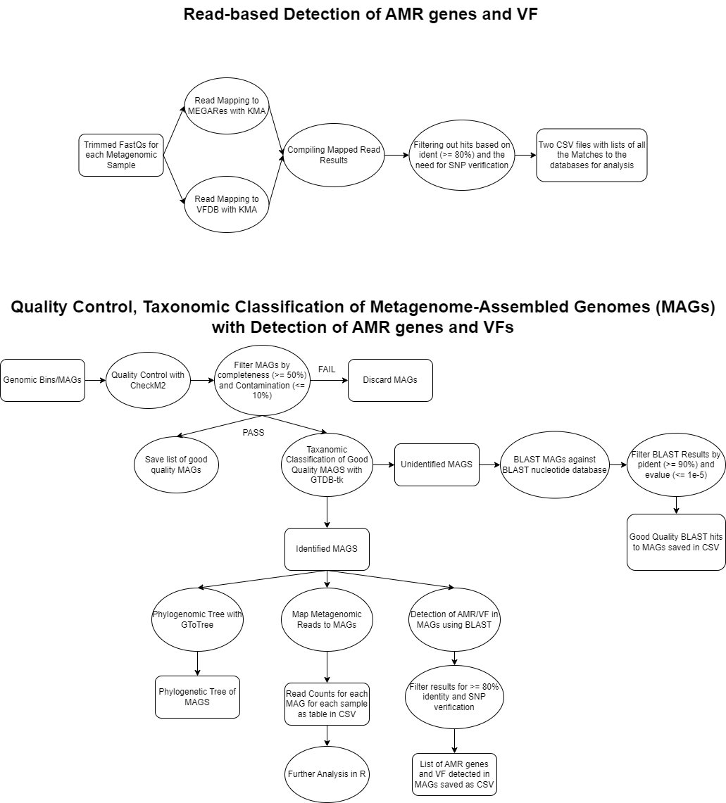

<!-- omit in toc -->
# snra-metagenomic-statistics-amrvf-ordc - USER GUIDE

---

## Overview

These scripts provide the inforamtion to process and analysis 16S sequencing and metagenomic sequencing reads originating for watershed data and analysed the ability to detect genera related to pathogenic bacteria, antimicrobial resistance genes and virulence genes using both sequencing methods. This data is also analyzed in relation to their accompanying metadata for the watershed samples (physicochemical properties of the water samples, weather, and land use data).

o Step 1: Run quality control scripts.
o Step 2: Run 16S pipeline (if applicable).
o Step 3: Run MAG assembly / binning / QC.
o Step 4: Run read-based AMR/VF detection.
o Step 5: Run specific R scripts and/or notebooks to generate tables and figures.


## Workflow diagrams

#### 16S Amplicon Sequence Processing

#### Metagenomic Sequence Processing



---

## Overall Data

- **16S Sequencing Data**: 16S Sequencing read are available here: 
- **Metagenomic Sequencing Data**: Metagenomic Sequencing read are available here:
- **Sample Metadata**: Sample metadata is available here:


---
## 16S Sequencing Read Processing
### Summary

This pipeline processes raw paired-end 16S rRNA sequencing data to generate denoised sequences, assign taxonomy, and construct a phylogenetic tree.

The pipeline includes:

1. Adapter detection and trimming with Atria
2. Importing reads into QIIME2
3. Primer trimming using Cutadapt
4. Quality inspection of demultiplexed reads
5. Denoising with DADA2
6. Exporting feature tables and representative sequences
7. Taxonomy assignment using a Greengenes2 reference
8. Phylogenetic tree construction


### Data
This pipeline requires paired-end 16S reads and a reference database.

Raw FASTQ reads: Paired-end sequences in .fastq.gz format generated by Illumina MiSeq (ENA Project PRJEB102733).
Reference database: Greengenes2 sequences and taxonomy files (.fasta and .tsv).
To download the reference data, run: wget https://ftp.microbio.me/greengenes_release/2022.10

### Installation

#### Pre-requisites

- Conda
- Atria
- Cutadapt
- QIIME2 2023.7
- Python 3.9+
- Recommended OS: Linux

#### Setup Instructions

- Clone the repository:

```bash
git clone https://github.com/AAFC-BICoE/SNRA-Metagenomic-Statistics-AMRVF-ORDC/
cd SNRA-Metagenomic-Statistics-AMRVF-ORDC
```

- Create the Conda environment

```bash
conda env create -f qiime2-amplicon-ubuntu-latest-conda.yml

conda activate qiime2-2023.7
```
Ensure Atria and Cutadapt are installed and available in your PATH.

### Parameters

| Parameter          | Description                                         | Type    | Default    | Example                 |
|--------------------|-----------------------------------------------------|---------|------------|-------------------------|
| `RAWDATA_DIR`   | Folder containing raw FASTQ reads           | Path    | `data`     | `/path/to/Raw_data`         | `./data/fastq`|
| `WKDIR`  | Working directory   | Path    | `/path/to/wdir`  | `./results` |
| `REF_DIR` |  Reference database location  | Path | `/path/to/Reference/greengene2`     | `./reference/greengene2`                 |
| `MANIFEST` | Manifest CSV file for QIIME2 import | File | `${WKDIR}/manifest.csv` | './manifest.csv' |
| `CONDA_ENV` | Conda environment name | String | `qiime2-2023.7` | `qiime2-2023.7` |
| `CPUS` | Number of CPU threads | Integer | `16` | `32` |
| `TRIM_LEFT_F/R` | Bases trimmed from 5’ end during DADA2 denoise | Integer | `0` | `17` |
| `TRUNC_F/R` | Bases to truncate at 3’ end during DADA2 denoise | Integer | `229/187` | `250/200` |
| `FWD` | Forward primer sequence | String | `GTGYCAGCMGCCGCGGTAA` | `N/A` |
| `REV` | Reverse primer sequence | String | `CGYCAATTYMTTTRAGTTT` | `N/A` |

Notes:

- All paths can be relative or absolute.
- If not specified, default values will be used.  
- Adjust truncation and trim lengths after inspecting the demux summary .qzv.
---

### Step-by-step Usage
#### Step 0: Activate Conda Environment
```
conda activate qiime2-2023.7
mkdir -p ${WKDIR}/logs ${WKDIR}/qiime2_output
cd ${WKDIR}
```
#### Step 1: Adapter Detection & Trimming (Atria)
```
cd ${RAWDATA_DIR}
atria --detect-adapter -r *_R1.fastq.gz -R *_R2.fastq.gz > ${WKDIR}/logs/atria_detect.txt 2>&1 || true

mkdir -p ${WKDIR}/16S_atria_trimmed_sequence_file
atria -a AGATCGGAAGAGCACA -A AGATCGGAAGAGCGTC \
      -r *_R1.fastq.gz -R *_R2.fastq.gz \
      -o ${WKDIR}/16S_atria_trimmed_sequence_file \
      > ${WKDIR}/logs/atria_trim.log 2>&1
```
#### Step 2: Import to QIIME2
```
qiime tools import \
  --type 'SampleData[PairedEndSequencesWithQuality]' \
  --input-path ${MANIFEST} \
  --output-path qiime2_output/16S_PE.qza \
  --input-format PairedEndFastqManifestPhred33 \
  &> ${WKDIR}/logs/qiime_import.log
```
#### Step 3: Primer Trimming (Cutadapt)
```
cd ${WKDIR}/qiime2_output
```
#### Step 3a: Trim primers
```
qiime cutadapt trim-paired \
  --i-demultiplexed-sequences 16S_PE.qza \
  --p-cores ${CPUS} \
  --p-front-f "${FWD}" \
  --p-front-r "${REV}" \
  --o-trimmed-sequences 16S_PE.primer.trimmed.qza \
  --verbose &> ${WKDIR}/logs/primer_trimming_step1.log
```
#### Step 3b: Trim reverse-complement primers
```
REVCOMP_FWD="TTACCGCGGCKGCTGRCAC"
REVCOMP_REV="AAACTAAAKRAATTRCG"

qiime cutadapt trim-paired \
  --i-demultiplexed-sequences 16S_PE.primer.trimmed.qza \
  --p-cores ${CPUS} \
  --p-front-f "${REVCOMP_FWD}" \
  --p-front-r "${REVCOMP_REV}" \
  --o-trimmed-sequences 16S_PE.primer.trimmed2.qza \
  --verbose &> ${WKDIR}/logs/primer_trimming_step2.log
```
#### Step 4: Inspect Demux Quality
```
qiime demux summarize \
  --i-data 16S_PE.primer.trimmed2.qza \
  --o-visualization 16S_PE.primer.trimmed2.qzv \
  &> ${WKDIR}/logs/demux_summary.log
```
Open .qzv in qiime tools view or upload to view.qiime2.org

#### Step 5: DADA2 Denoising
```
mkdir -p DADA2_denoising_output
TRIM_LEFT_F=0
TRIM_LEFT_R=0
TRUNC_F=229
TRUNC_R=187

qiime dada2 denoise-paired \
  --i-demultiplexed-seqs 16S_PE.primer.trimmed2.qza \
  --p-trim-left-f ${TRIM_LEFT_F} \
  --p-trunc-len-f ${TRUNC_F} \
  --p-trim-left-r ${TRIM_LEFT_R} \
  --p-trunc-len-r ${TRUNC_R} \
  --p-n-threads ${CPUS} \
  --output-dir DADA2_denoising_output \
  --verbose &> ${WKDIR}/logs/DADA2_denoising.log
```
#### Step 6: Export DADA2 Outputs
```
qiime metadata tabulate \
  --m-input-file DADA2_denoising_output/denoising_stats.qza \
  --o-visualization DADA2_denoising_output/denoising_stats.qzv

qiime tools export \
  --input-path DADA2_denoising_output/representative_sequences.qza \
  --output-path representative_sequences

qiime tools export \
  --input-path DADA2_denoising_output/table.qza \
  --output-path feature-table

biom convert -i feature-table/feature-table.biom -o feature-table/feature-table.tsv --to-tsv
```
#### Step 7: Taxonomy Assignment
```
REF_FASTA="${REF_DIR}/ref_seqs.fasta"
REF_TAX="${REF_DIR}/ref_taxonomy.tsv"
REF_PREFIX="greengenes2"

qiime feature-classifier extract-reads \
  --i-sequences "${REF_FASTA}" \
  --p-f-primer "${FWD}" \
  --p-r-primer "${REV}" \
  --p-min-length 300 \
  --p-max-length 600 \
  --o-reads "${REF_PREFIX}.V4-V5.qza"

qiime feature-classifier fit-classifier-naive-bayes \
  --i-reference-reads "${REF_PREFIX}.V4-V5.qza" \
  --i-reference-taxonomy "${REF_TAX}" \
  --o-classifier "${REF_PREFIX}.classifier_V4-V5.qza"

qiime tools import \
  --type 'FeatureData[Sequence]' \
  --input-path representative_sequences/dna-sequences.fasta \
  --output-path representative_sequences.qza

qiime feature-classifier classify-sklearn \
  --i-classifier "${REF_PREFIX}.classifier_V4-V5.qza" \
  --i-reads representative_sequences.qza \
  --o-classification rep_fasta.classified.gg2_V4-V5.qza
```
#### Step 8: Phylogenetic Tree Construction

```
 qiime phylogeny align-to-tree-mafft-fasttree \ --i-sequences DADA2_denoising_output/representative_sequences.qza \ --output-dir phylogenetic_tree \ --p-n-threads ${CPUS}
```
### Output


Output files include:

| File/Folder	| Description |
|------------|--------------|
| 16S_PE.primer.trimmed2.qzv |	Demultiplexed and primer-trimmed reads summary |
| DADA2_denoising_output |	Denoised sequences and feature tables |
| feature-table/feature-table.tsv |	Exported feature table in TSV format |
| representative_sequences/dna-sequences.fasta |	Representative sequences of ASVs |
| rep_fasta.classified.gg2_V4-V5/	| Taxonomy assignments in TSV format |
| phylogenetic_tree/ |	Phylogenetic tree QZA and related visualizations |
| logs/	| Log files for all steps |

---
## Metagenomic Read-Based Detection of Antimicrobial Resistance and Virulence Genes

### Summary

Metagenomic trimmed reads are mapped to an antimicrobial resistance gene and a virulence gene database to determine is these types of genes are present in the samples.

### Data
Trimmed (using Trimmomatic) metagenomic reads for each of the samples in compressed fastq format.

### Installation

#### Pre-requisites

- Conda
- fastqc
- multiqc
- bowtie2
- samtools
- bedtools
- kma
- Python 3.9+
- Recommended OS: Linux

#### Setup Instructions

- Clone the repository:

```bash
git clone https://github.com/AAFC-BICoE/SNRA-Metagenomic-Statistics-AMRVF-ORDC/
cd SNRA-Metagenomic-Statistics-AMRVF-ORDC
```

- Create the Conda environment

```bash
conda env create -f conda_env/multifastqc.yaml
conda env create -f conda_env/metareadcounts.yaml
```
Download VFDB (http://www.mgc.ac.cn/VFs/download.htm; lastupdate: Fri Dec 1 19:30:02 2023)
 and MegaRESv3 (https://www.meglab.org/megares/download/) and put them in your PATH

### Parameters
The bash scripts have three components:
1. The main script: This has the actual command for software that I want to run on the samples.

```
#!/bin/bash -l
#starts calling bash with the HPC specific details

#initating conda 
source ~/miniconda3/etc/profile.d/conda.sh
#activating conda environment with fastqc (or other software you are using) installed
conda activate multifastqc

#calling the variable from the assisting script to bring sample information into script
line=$1

#the actual code/software I want to execute on the sample
fastqc "$line"_R1.atria.fq.gz
fastqc "$line"_R2.atria.fq.gz
```
2. The assisting script: This ensures that all the samples run in a separate job and using the main script.
```
#calling bash
#!/bin/bash -l
#loop the command to run the main script through a list of samples
cat "list_MG_samples.txt" | while IFS= read -r line; do
    echo "Processing line: $line"
    sbatch fastqc.sh "$line"
done
```
3. The list of samples I want to run
```
SN005-20160524
SN005-20160606
SN005-20160704
 ```

---

### Step-by-step Usage
### Read_Quality_Control
1. Run fastqc on all the metagenomic reads (in compressed fastq format) (*fastqc.sh* and *assisting_fastqc.sh*).
2. Use MultiQC to get the results from fastqc in one report (*multiqc.sh*).

### Read-based_AMR_VF_Detection
1. Use Bowtie2 and SAMtools to map metagenomic reads to the MEGARes database (*mappingread.sh*).
2. Assisting script for 1 to read map for every sample listed in the accompanying txt file (one sample per line) (*assisting_mappingread.sh*).
3. Use Bowtie2 and SAMtools to map metagenomic reads to the VFDB database (*VFDB_mappingread.sh*).
4. Assisting script for 3 to read map for every sample listed in the accompanying txt file (*assisting_VFDB_mappingread.sh*).
5. Use the experimentally proven VFDB database with read mapping with Bowtie2 and SAMtools (*VFDB_exp_mappingreads.sh*).
6. Assisting script for 5 to read map for every sample listed in the accompanying txt file (*assisting_VFDB_exp_mappingreads.sh*).
7. Map reads for MEGARes using KMA (*mapping_AMR_KMA.sh*).
8. Assisting script for 7 to read map for every sample listed in the accompanying txt file (*assisting_mapping_AMR_KMA.sh*).
9. Map reads for VFDB using KMA (*mapping_VFDB_KMA.sh*).
10. Assisting script for 9 to read map for every sample listed in the accompanying txt file (*assisting_mapping_VFDB_KMA.sh*).

### Output
A list of the AMR genes and VFs present in each metagenomic sample.
| File/Folder	| Description |
|------------|--------------|
| output/"$line" | TXT file with the table of AMR genes from MegaRES mapped to a particular set of reads (specified in the variable $line in the bash scripts) |
| KMA_output/"$line"_VFDB |	TXT File with the table of virulence genes from VFDB mapped to a particular set of reads ( specified in the variable $line in the bash scripts) |
---

## Metagenomic Read-Based Detection of Antimicrobial Resistance and Virulence Genes

### Summary

Metagenomic reads are taxonomically characterized and analysed as well as Metagenome-assembled genomes. MAGS are also characterized for their antimicrobial resistance and virulence gene content.

### Data
Trimmed (using Trimmomatic) metagenomic reads for each of the samples in compressed fastq format.
Metadata that was collected related to the sample.

### Installation

#### Pre-requisites

Reads are first taxonomically characterised using the custom Snakemake pipeline found here: [snra-metagenomic-statistics-amrvf-ordc-report](https://github.com/AAFC-Bioinfo-AAC/snra-metagenomic-statistics-amrvf-ordc-report)

- Conda
- kma
- samtools
- bowtie2
- checkm2
- gtdb-tk
- BLAST
- gtotree
- Python 3.9+
- Recommended OS: Linux

#### Setup Instructions

- Clone the repository:

```bash
git clone https://github.com/AAFC-BICoE/SNRA-Metagenomic-Statistics-AMRVF-ORDC/
cd SNRA-Metagenomic-Statistics-AMRVF-ORDC
```

- Create the Conda environment

```bash
conda env create -f conda_env/checkm2.yaml
conda env create -f conda_env/gtdbtk.yaml
conda env create -f conda_env/blast.yaml
conda env create -f conda_env/mapping_reads.yaml
conda env create -f conda_env/gtotree.yaml
```

You must download the GDTK database as well as VFDB and MegaRES and have them in your PATH.

### Parameters
The bash scripts have three components:
1. The main script: This has the actual command for software that I want to run on the samples.

```
#!/bin/bash -l
#starts calling bash with the HPC specific details

#initating conda 
source ~/miniconda3/etc/profile.d/conda.sh
#activating conda environment with fastqc (or other software you are using) installed
conda activate multifastqc

#calling the variable from the assisting script to bring sample information into script
line=$1

#the actual code/software I want to execute on the sample
fastqc "$line"_R1.atria.fq.gz
fastqc "$line"_R2.atria.fq.gz
```
2. The assisting script: This ensures that all the samples run in a separate job and using the main script.
```
#calling bash
#!/bin/bash -l
#loop the command to run the main script through a list of samples
cat "list_MG_samples.txt" | while IFS= read -r line; do
    echo "Processing line: $line"
    sbatch fastqc.sh "$line"
done
```
3. The list of samples I want to run
```
SN005-20160524
SN005-20160606
SN005-20160704
 ```

---

### Step-by-step Usage
#### MAG_processing
1. Get MAG completeness and contamination with CheckM2 (*checkm2.sh*).
2. Taxonomic classification of MAGs with GTDB-tk (*gtdb-tk.sh*).
3. Blast MAGs with MEGARes database for AMR genes using (*blast_megares.sh*).
4. Assisting script for 3 (*assisting_blast_megares.sh*).
5. Blast MAGs with VFDB database for VF (*blast_vfdb.sh*).
6. Assisting script for 4 (*assisting_blast_vfdb.sh*).
7. Blast unidentified MAGs to determine their content (*blast_nt_db.sh*).
8. Assisting script for 7 (*assisting_blast_nt_db.sh*).
9. Using GToTree to get a phylogenetic tree of the identifiable bacteria MAGs (*gtotree.sh*).
   
#### MAG_read_mapping
1. Mapping metagenomic reads to the identified MAGs using bwa and SAMtools (*MAG_read_mapping.sh*).
2. Assisting script used to run all combinations of MAG and metagenomic read sets (*assisting_MAG_read_mapping.sh*).

### Output
The output is Metagenome-assembled genomes that are taxonomically classified and the antimicrobial resistance and virulence genes detected in these MAGs.
| File/Folder	| Description |
|------------|--------------|
| checkm2_results | Folder with TXT files with completeness information for each of the MAGs |
| GTDB_class_output | Folder with TXT files with the taxonomic classification of all the MAGs |
| "$line"_megares_output | TXT File with all the AMR genes from MegaRES that were mapped to a specific MAG |
| "$line"_vfdb_output | TXT File with all the VF genes from VFDB that were mapped to a specific MAG |
| "Read_mapping_counts_"$mag"_"$sample".txt" | TXT File with read mapping results for a particular sample and MAG|
---

## Additional Jupyter Notebooks and R scripts used in Analysis

### Summary
Analysis of the results from the processing described above was done using Jupyter Notebooks (data cleaning and organization) and R scripts (Data analysis and Visualization). For analysis of the results, there are scripts for both preliminary results and for the final results presented in the manuscript.

### Data
All data producted for the previous steps and Metadata provided about the original samples.

### Jupyter Notebooks
#### KMA_AMR_VF_detection.ipynb
1. Accumulate all of the AMR and VF read mapping results.
2. Filter AMR results to only include hits that have 80% or higher identity and are not marked with the requirement for SNP verification.
3. Filter VFDB results so only results with 80% or higher identity are included.
4. Save AMR and VF read mapping results in CSV format.

#### Filtering_MAG_quality.ipynb
1. Import results for CheckM2.
2. Filter the results so only the MAGs with over 50% completeness and less than 10% contamination remain.
3. Determine the number of remaining good quality MAGs.
4. Save list of good quality MAGs as CSV.

#### MAG_BLAST_FIlter_Results.ipynb and MAG_BLAST_results.ipynb
1. Import and accumulate all the BLAST nucleotide results.
2. Filter the results to those with 90% or greater identity and e-values less than 1e-5.
3. Save filtered results as CSV.
 
#### tables_AMR_VF_MAGS.ipynb
1. Import and accumulate all the MAG BLAST results for MEGARes and VFDB.
2. Filter the MEGARes results to include hits of 80% or greater identity and those results that do not require SNP verification.
3. Create a crosstab of all the remaining MEGARes hits and which MAG they are detected in.
4. Filter VFDB results to include hits with 80% or greater identity.
5. Create a crosstab of the remaining VFDB hit and which MAGs they are detected in.
6. Save the resulting tables and crosstabs as CSV.

### R scripts
#### Preliminary Results
### Normalized_Read_Depths.R
1. Calculate the normalized read depths for all the metagenomic samples.
2. Compare normalized read depths between sample blocks (pairwise comparisons and p-values).
3. Make a boxplot of the normalized read depths in each block.
4. Get the minimum, maximum, and average normalized read depths for all the samples.
    
### clr_transform_and_analysis.R
1. Relative abundances from metagenomic reads.
2. clr transformation of relative abundances.
3. Generate a large table with all the relative abundances and metadata (weather, land use, and physicochemical data) used for statistical analysis.
4. LME calculations for land use, season, and AMR/VF for all relative abundances and physicochemical properties, including p-values and pairwise comparisons.
5. ANOVA for AMR/VF, land use, and season.
6. PLS-DA.
7. Visualization of PLS-DA.

### diversity_metrics.R
1. Alpha diversity for metagenomic samples.
2. Alpha diversity difference between land use.
3. Beta diversity.
4. Beta diversity differences with land use.

### PCP_landuse_season.R
1. LME-based boxplots showing the difference in physicochemical properties by land use, season, and land use:season.

### network_analysis.R
1. Network analysis of the metagenomic data.
2. Relationship between module eigenvalues and all metadata.
3. Visualization of network analysis.

### MAG_RA_metadata.R
1. Relative abundances of MAGs
2. clr transformation of relative abundances of MAGs.
3. LME of land use, season, and land use:season for MAGs.
4. Visualizations.

### normalization_and_chi-squared_test.R
*a rough draft script for normalization and transformation of metagenomic data*
1. Chi-squared test for AMR genes and VFs against land use and season

#### Final Results
### Shietal_GRDI_pathogen_AMR_R_code_1_Data_manipulation.R
1. Creates phyloseq objects for fecal-associated microbial communities using both amplicon and shotgun metagenomic data.
2. Compiles a genus-level pathogen list.
3. Generates phyloseq objects specifically for fecal-associated potential pathogen communities (amplicon- and shotgun-based).

### Shietal_GRDI_pathogen_AMR_R_code_2_Core&CRT_16S.R
1. Identifies conditionally rare taxa (CRT) and core microbiome members within the fecal-associated bacterial community.
2. Quantifies the contributions of core and CRT taxa to overall Bray–Curtis dissimilarity (%).
3. Performs statistical analyses and random forest modeling to evaluate key patterns.
4. Generates associated figures for these analyses.


### Shietal_GRDI_pathogen_AMR_R_code_3_All_Figures_plotting.R
1. Contains all figure-generation scripts, including main and supplementary figures.
2. Integrates statistical analysis and data visualization workflows for final outputs.

# Additional Notes

1. Use of 80% cutoff for detection of AMR genes and VF. \
By setting the pident threshold to >= 80%, only sequences with a high degree of similarity to known AMR or VF sequences are retained which reduces false positive results. A higher threshold increases specificity but it may decrease sensitivity by potentially excluding sequences that are biologically relevant but have lower sequence similarity. If the cutoff is set too low, it can lead to increased false positives and noise in the results. Sequences with pident >= 80% are likely to share significant homology with known AMR or VF sequences, which can mean a strong likleihood of functional similarity. IT can allows us to focus on matches that are biologically meaningful and relevant to downstream analysis. A threshold of >= 80% strickes a balance between specificity and sensitivity, minimizing false positives while still capturing biologically relevant matches. A threshold of >=80% is also commonly used in many AMR and VF detection pipelines, using this cutoff provides consistency and comparability across studies.
  
2. Rationale for the requirement for SNP verification in MEGARes results and the exclusion of such results. \
Verification of SNPs ensures the reliability of the detectede variations. By, confirming the presence of SNPs through additional experimental or computational validation, researchers can have more confidence in the accuracy of results. This is essential for downstream anlayses and intepretations in the context of AMR where accurate detection of genetic variants is essential for understanding mechanisms of resistance. SNP verification also helps to reduce false positives. While bioinformatic tools like MEGARes are powerful for identifying putative AMR genes or variants, they can also produce false positives and SNP verification helps distinguish true positive variants from noise or artifacts improving the reliability of the analysis. Verifying SNPs can provide insights into thier functional impact and can serve as a form of quality control.The requirement for SNP verification in MEGARes and the exclusion of unverified variants is essential for ensuring the reliability, accuracy, and clinical relevance of the detected genetic variations associated with antimicrobial resistance. IT helps to improve the quality of genomic analysis, reduces false positives, and can provide meanting ful insights into the mechanisms of AMR. Since verification could not be done, deteminant that would require SNP verification were excluded from our analysis.
   
3. Protocol for comparing read-based and MAG-based AMR genes and VF detection. \
   The read-based and MAG-based AMR were compared in terms of antimicrobials that the genes are associated with, mechanisms of resistance and particular genes detected buy both methods. The number of copies of each gene was not considered because the accuracy of the copy number is very limited by both read-based and MAG-based detection.
4. Approaches for assessing statistical model performance. \
Multicollinearity Assessment: \
You can access multicollinearity, which occurs when predictor variables are highly correlated, using corraltion matrices. You can establish threshold values to identify problematic multilinearity and address it through variable selection or data transformation if detected. \
Overfitting Evaluation: \
Overfitting, which can lead to the model capturing noise rather than patterns, was evaluated using cross-validation and bootstrap resampling techniques. Overfitting is detected automatically in the nlme and lme 4 R packages. We ensured that the model complexity was balanced to minimize overfitting while capturing relevant patterns in the data. \ 
Heteroscedasticity Examination: \
 We examined heteroscedasticity, which refers to unequal variances across levels of the independent variable, through visual inspection of residuals plots and statistical test. Any detected heteroscedasticity was addressed through data transformation or robust standard errors. \
Model Validation: \
Model validation was performed to assess the generalizability of the results, using criteria such as the goodness-of-fit measures and prediction accuracy.
6. Highlights of Protocol for Metadata Handling. \
This is crucial for ensuring consistency and comparability across studies. \
Metadata was organized into a single dataframe. Each rows represented a sample and each column represented a piece of metadata. Each sample contains data for each metadata category and samples with incomplete metadata were not used in the analysis. EAch value for physicochemical properties can a defined metric for concentration that was consistent throughout all of the samples. Categorical metadata such as season and land use type has a consistent ontology. For instance, season was divided by each 3 month period as Winter, Spring, Summer and Autumn. Land use types were defined as either Agri-ditch, Forested or Mixed based on the dominant land use type near the sampling location.

# Software and Package Version
MegaRES v.3.0.
VFDB v12-06-2023 (complete set)
KMA v.1.3.23
Trimmomatic v.0.39.
FastQC v.0.12.1.
MultiQC v.1.2.
Kraken2 v.2.1.3.
Bracken v.2.9.
Snakemake v.7.32.4.
compositions v.2.0-6. (R package)
vegan v.2.6.4 (R package)
GUnifrac v.1.8. (R package)
ggplot2 v.3.4.4. (R package)
ellipse v.0.5.0. (R package)
WGCNA v.1.72.5. (R package)
heatmaply v.1.5.0. (R package)
lme4 v1.1.35.1. (R package)
BBDuk (https://sourceforge.net/projects/bbmap/)
MEGAHIT v.1.2.9.
Prodigal v.2.6.3.
Bowtie2 v.2.5.4.
samtools v.1.19.2., v.1.22.1, and v.2.6.3.
CONCOCT v.1.1.0.
Metabat2 v.2.12.1.
Das_tools v.1.1.3.
Checkm2 v.1.0.1.
GTDB-tk v.2.3.2.
BLAST v.2.15.0. (nucleotide database v07-31-2023)
BWA v.0.7.17.
nlme v.3.1.164. (R package)
emmeans v.1.9.0. (R package)
broom v.1.0.5. (R package)
ggpubr v.0.6.0. (R package)
gridExtra v.2.3. (R package)
GToTree v.1.8.4
HMMER3 v.3.4.
MUSCLE v.5.1.
trimAl v.1.4.1.
FastTree v2.1.11
iTOL v6
MAFFT
DADA2
Cutadapt
Qiime2 v.qiime2-2023.7 and all plugins v.2023.7.0
Atria v.4.0.2
KMA v.1.6.8
bedtools v.2.31.1
R v4.5.1  
vegan v2.6-6.1 (R package)
biodiversityR v2.16-1 (R package)
MASS v7.3-60.4, v7.3-65 (R package)
glmmTMB v1.1.12 (R package)
emmeans v1.10.2 (R package)
randomForest v4.7-1.1 (R package)
RcmdrMisc v2.9-1 (R package)
dtw v1.23.1  (R package)
pheatmap v1.0.13 (R package)
dplyc v1.1.4 (R package)
ggplot2 v2.0.0 (R package)
cowplot v1.2.0 (R package)
tidyverse v2.0.0 (R package)
tidyr v.1.3.1 (R package)
phyloseq v1.52.0 (R package)
stringr v1.5.2 (R package)
TSA v1.3.1 (R package)
reshape2 v1.4.4 (R package)
viridis v0.6.5 (R package)
ggpubr v0.6.1 (R package)
Hmisc v5.2-3 (R package)
pdp v0.8.2 (R package)
VennDiagram v1.7.3 (R package)
ggvenn v0.1.10 (R package)

 
